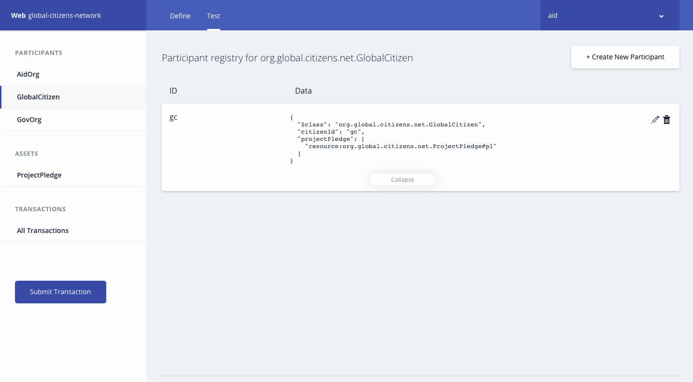
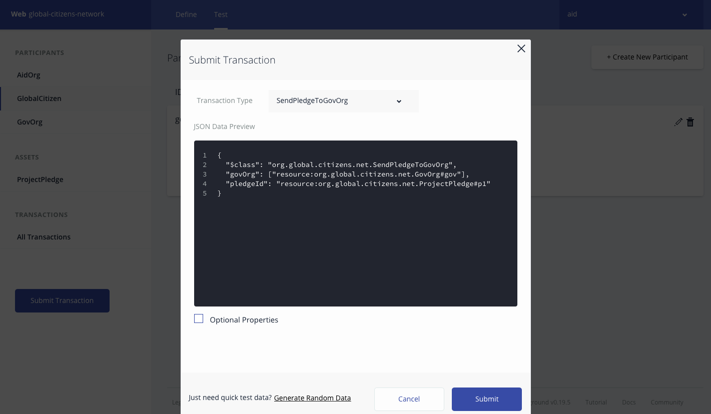

*Read this in other languages: [English](README.md), [한국어](README-ko.md).*

# Global-citizen


ここでの目標は、IBM ブロックチェーン・プラットフォームを使用して、以下の3メンバーからなるブロックチェーン・アプリケーションを構築することです。

* 政府機関を代表する組織
* 支援の提供に重点を置くNGOを代表する組織
* Global Citizen

対象レベル：中級 開発者

## 前提条件

1. フリーの [IBM Cloud アカウント](https://www.ibm.com/cloud/)

2. [NPM](https://www.npmjs.com/) と Node (version 8.10.0) のインストール

3. 他のバージョンの composer-cli を導入済みの場合、または以前に .bna ファイルをデプロイしている場合は、以下のコマンドを実行してください
```
npm uninstall -g composer-cli
npm uninstall -g composer-rest-server
rm -rf ~/.composer
rm *.card
rm -rf credentials/
```

4. composer-cli のインストール
```bash
npm install -g composer-cli@0.19.5
```

## 手順

1. [Business Network Archive (BNA) の生成](#1-generate-the-business-network-archive-bna)

2. [ブロックチェーン サービスの作成](#2-create-blockchain-service)

3. [シークレットを入手](#3-get-the-secret)

4. [シークレットを使用して認証局から証明書を取得する](#4-use-secret-to-get-certificates-from-the-certificate-authority)

5. [admin-pub.pem ファイルを使用してピアに証明書を追加](#5-use-admin-pubpem-file-to-add-certificates-to-the-peers)

6. [管理者用 Business Network カードの作成](#6-create-admin-business-network-card)

7. [ランタイムをインストールし Network を開始する](#7-install-runtime-and-start-the-network)

8. [新しい Business Network カードを作成する](#8-create-a-new-business-network-card)

9. [Business Network と対話する](#9-interact-with-the-business-network)

<a name="1-generate-the-business-network-archive-bna"></a>
## 1. Business Network Archive (BNA) の生成

Business Network は、資産(assets)、参加者(participants)、トランザクション、アクセス制御ルール、およびオプションでイベントと参照で構成されています。
この Business Network の雛形 (スケルトン) には、Business Network 内のすべての資産、参加者、およびトランザクションのクラス定義を含むモデル (**.cto**) ファイルがあります。
また、Business Network の雛形には、基本的なアクセス制御ルールを含むアクセス制御 (**permissions.acl**) ドキュメント、トランザクションのプロセッサ機能を含むスクリプト (**logic.js**) ファイル、および Business Network のメタデータを含む **package.json** ファイルも含まれます。

まず、BNAファイルを作成するために必要な3つのコンポーネント、ロジックファイル (**.js**)・モデルファイル (**.cto**)・アクセス制御ファイル (**.acl**) を含むリポジトリをクローンする必要があります。

```bash
git clone https://github.com/IBM/global-citizen.git
```

ファイルの構造が有効であることを確認するために、Business Network 定義のための Business Network Archive (BNA) ファイルを生成できます。
BNAファイルは、デプロイ可能なユニットで、実行のために Composer ランタイムにデプロイできるファイルです。
Network Archive を生成するには、次のコマンドを使用します:
```bash
cd global-citizen
npm install
```

次の出力が表示されます:
```bash
Creating Business Network Archive


Looking for package.json of Business Network Definition
	Input directory: /Users/ishan/Documents/proj/global-citizens/global-citizens-network/global-citizen

Found:
	Description: This pattern should be able to Construct a 3-member blockchain application using the IBM Blockchain Platform, consisting of the following entities: an organization representing a government entity, an organization representing an NGO focused on the provision of aid, and an organization representing Global Citizen.
	Name: global-citizens-network
	Identifier: global-citizens-network@0.0.1

Written Business Network Definition Archive file to
Output file: global-citizens-network@0.0.1.bna

Command succeeded
```

これで BNA ファイル (global-citizens-network.bna) が `global-citizens/dist` ディレクトリに作成されるはずです。

<a name="2-create-blockchain-service"></a>
## 2. ブロックチェーン サービスの作成

1. ブラウザで [IBM Cloud アカウント](https://console.bluemix.net/dashboard/apps) にログインします

2. ブロックチェーン サービスを作成します:


<a name="3-get-the-secret"></a>
## 3. シークレットを入手

1. ブロックチェーンサービスを起動し、接続プロファイルをクリックし、JSON形式そのままで表示します

2. `registrar` まで下にスクロールし、`enrollId` の下に `enrollSecret` を表示します。このシークレットをコピーしておき、次のステップで、認証局(CA)用の Business Network カードを作成する際に使用します。


<a name="4-use-secret-to-get-certificates-from-the-certificate-authority"></a>
## 4. シークレットを使用して認証局から証明書を取得する

1. 接続プロファイルをダウンロードします

2. ダウンロードした JSON ファイルを `connection-profile.json` にリネームします

3. `connection-profile.json` ファイルを `global-citizen` ディレクトリに移動します

4. 前のステップの `enrollSecret` を使用して以下のコマンドを発行し、認証局(CA)の Business Network カード (ca.card ファイル) を作成します
```bash
composer card create -f ca.card -p connection-profile.json -u admin -s <enrollSecret>
```

5. 以下のコマンドを使用してローカルシステム上の Wallet にカードをインポートします
```bash
composer card import -f ca.card -c ca
```

6. 最後に、`enrollSecret` を含むインポート済みのカードを使用して、CAから証明書を要求します。以下のコマンドの完了後に作成される `credentials` ディレクトリに、証明書が格納されます
```bash
composer identity request --card ca --path ./credentials
```

<a name="5-use-admin-pubpem-file-to-add-certificates-to-the-peers"></a>
## 5. admin-pub.pem ファイルを使用してピアに証明書を追加

1. ブロックチェーン サービスに戻り、`Members` タブをクリックして証明書を追加します。`global-citizen/credentials` ディレクトリに移動し、`admin-pub.pem` ファイルの内容をコピーして `Certificate` テキスト入力欄に貼り付けます。 `Submit` ボタンをクリックして送信し、ピアを再起動します。

  
  >ノート: ピアを再起動するのに1分ほどかかります。

2. 次に、チャネルの証明書を同期させる必要があります。ブロックチェーンサービスから、`my network` の下にある `Channels` をクリックし、次に3点ドット(`…`)ボタンをクリックします。次に、`Sync Certificate` をクリックします。

  

<a name="6-create-admin-business-network-card"></a>
## 6. 管理者用 Business Network カードの作成

1. ピアと証明書を同期させたので、Hyperledger Composer ランタイムをインストールし、管理者用カードを作成して Network を開始することができます。次のコマンドを使用して、チャネル管理者およびピア管理者の役割を持つ管理者カードを作成します:
```bash
composer card create -f adminCard.card -p connection-profile.json -u admin -c ./credentials/admin-pub.pem -k ./credentials/admin-priv.pem --role PeerAdmin --role ChannelAdmin
```

2. 前のコマンドで作成したカードをインポートします:
```bash
composer card import -f adminCard.card -c adminCard
```

<a name="7-install-runtime-and-start-the-network"></a>
## 7. ランタイムをインストールし Network を開始する

1. 管理者用カードを使用して、次のコマンドで Network をインストールします:
```bash
composer network install --card adminCard --archiveFile global-citizens-network@0.0.1.bna
```
>ノート: この時点でエラーが発生した場合は、1分待ってからもう一度試してください。

2. 管理者用カード、.bnaファイルのパス、CAから受信した資格情報を入力して、Business Network を開始します。 このコマンドは削除すべきカードを発行します。これは ‘delete_me.card’ と呼ばれます。
```bash
composer network start --networkName global-citizens-network --networkVersion 0.0.1 -c adminCard -A admin -C ./credentials/admin-pub.pem -f delete_me.card
```
>ノート: この時点でエラーが発生した場合は、1分待ってからもう一度試してください。

3. 次に、‘delete_me.card’ を削除しましょう:
```bash
rm delete_me.card
```

<a name="8-create-a-new-business-network-card"></a>
## 8. 新しい Business Network カードを作成する

1. ランタイムをインストールして Network を開始したら、Starter プランにデプロイするカードを作成する必要があります。次のコマンドを使用して `adminCard.card` を作成してください:
```bash
composer card create -n global-citizens-network -p connection-profile.json -u admin -c ./credentials/admin-pub.pem -k ./credentials/admin-priv.pem
```

2. Business Network カードをインポートします:
```bash
composer card import -f admin@global-citizens-network.card
```

3. Business Network カードをテストします:
```bash
composer network ping -c admin@global-citizens-network
```

<a name="9-interact-with-the-business-network"></a>
## 9. Business Network と対話する

Composer-Playground または Composer-Rest-Server を使用して、Business Network と対話することができます。

より詳しい情報は [composer-playground](https://hyperledger.github.io/composer/latest/introduction/introduction) や [composer-rest-server](https://hyperledger.github.io/composer/latest/integrating/getting-started-rest-api) を参照してください。

<a name="a-interact-using-composer-playground"></a>
### a. Composer-Playground を使って対話する

1. Composer-Playground をインストールする:
```bash
npm install -g composer-playground@0.19.5
```
2. さあ、サーバーを起動しましょう。`connection-profile.json` ファイルのあるディレクトリで、以下を実行します:
```bash
composer-playground
```
3. ブラウザで [http://localhost:8080/test](http://localhost:8080/test) を開き、Business Network を操作します。

  global-citizen Business Network のための `Admin card` が、Composer Playground に作成されます。

  

  `admin@global-citizens-network` カードの `Connect now` ボタンをクリックして、global-citizen Business Network に接続してください

  

  Business Network の定義をテストするには、まず **Test** タブをクリックします。

  `AidOrg` 参加者レジストリで、新しい参加者を作成します。 左にあるメニューの最初にある `AidOrg` をクリックし、`Create New Participant` ボタンをクリックしてください。

  

  `AidOrg` 参加者の情報を入力し、`Create New` をクリックします。

  

  新しい `AidOrg` 参加者が、参加者レジストリに作成されました。同様に、ネットワークの他の参加者を作成します。

  

  接続プロファイルには、Fabric に接続するために必要な情報が含まれています。Business Network カードは、接続プロファイル、ID、証明書を組み合わせて、Hyperledger Composer Playground 内の Business Network に接続できるようにします。

  これでネットワークの参加者のために **Network カード** を追加する準備が整いました。これを行うには、最初に `admin` タブをクリックし、`ID Registry` を選択して **新しい ID** を参加者に発行し、IDをウォレットに追加します。下のイメージに示された手順に従ってください:

  

  

  

  

  Network のトランザクションを実行するため、`AidOrg` 参加者レジストリを選択して `Use Now` をクリックします。

  

  `CreateProjectPledge` トランザクションを実行します。
  ```
{
  "$class": "org.global.citizens.net.CreateProjectPledge",
  "pledgeId": "p1",
  "name": "child care",
  "decription": "child care fund",
  "fundsRequired": 100000,
  "aidOrg": "resource:org.global.citizens.net.AidOrg#aid"
}
```
  

  資産の登録簿に新しいプロジェクト Pledge (寄付の提案書) が作成されます。
  

  `SendPledgeToGlobalCitizen` トランザクションを実行し、作成した Pledge を Global Citizen に送信することで、プロジェクトへの資金を得ます。
  ```
{
  "$class": "org.global.citizens.net.SendPledgeToGlobalCitizen",
  "citizenId": "resource:org.global.citizens.net.GlobalCitizen#gc",
  "pledgeId": "resource:org.global.citizens.net.ProjectPledge#p1"
}
```
  

  Global Citizen 参加者の登録簿は、新たな Pledge の要求で更新されます。
  

  Global Citizen が Pledge をレビューします。検証して問題がなければ、政府機関から Pledge のための資金を得るために、`SendPledgeToGovOrg` トランザクションを実行します。
  ```
{
  "$class": "org.global.citizens.net.SendPledgeToGovOrg",
  "govOrg": ["resource:org.global.citizens.net.GovOrg#gov"],
  "pledgeId": "resource:org.global.citizens.net.ProjectPledge#p1"
}
```
  

  政府機関が Pledge をレビューします。彼らがプロジェクトに資金を提供するかどうかを検討した後、彼らはプロジェクトの Pledge 資産を更新するために `UpdatePledge` トランザクションを実行します。
  ```
{
  "$class": "org.global.citizens.net.UpdatePledge",
  "govOrgId": "resource:org.global.citizens.net.GovOrg#gov",
  "pledgeId": "resource:org.global.citizens.net.ProjectPledge#p1",
  "fundingType": "WEEKLY",
  "approvedFunding": 100000,
  "fundsPerInstallment": 1000
}
```
  

  

  

  政府機関は定期的に `TransferFunds` トランザクションを実行してプロジェクトに資金を送ります。
  ```
{
  "$class": "org.global.citizens.net.TransferFunds",
  "govOrgId": "resource:org.global.citizens.net.GovOrg#gov",
  "pledgeId": "resource:org.global.citizens.net.ProjectPledge#p1"
}
```
  

  

### b. composer-rest-server を使って対話する

1. composer-rest-server をインストールする:
```bash
npm install -g composer-rest-server@0.19.5
```

2. さあ、サーバーを起動しましょう。`connection-profile.json` ファイルのあるディレクトリで、以下を実行します:
```bash
composer-rest-server -c admin@global-citizens-network -n never -w true
```

3. ブラウザで [http://localhost:3000/explorer](http://localhost:3000/explorer) をアクセスします

4. これで swagger API が利用可能になり、[Composer-Playground を使って対話する](#a-interact-using-composer-playground) セクションで示された内容を Business Network に対して実行できます。

## パターンの拡張

1. ネットワーク権限を追加する
2. ダッシュボードの実装
3. 支払いのデフォルトを追跡するロジックを実装する
4. 通知ロジックの実装
5. ファンドの移転ロジックを改善する

## その他のリソース
* [Hyperledger Fabric ドキュメント](http://hyperledger-fabric.readthedocs.io/en/latest/)
* [Hyperledger Composer ドキュメント](https://hyperledger.github.io/composer/latest/introduction/introduction.html)

## ライセンス
[Apache 2.0](LICENSE)
