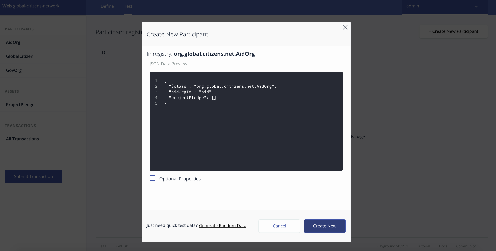
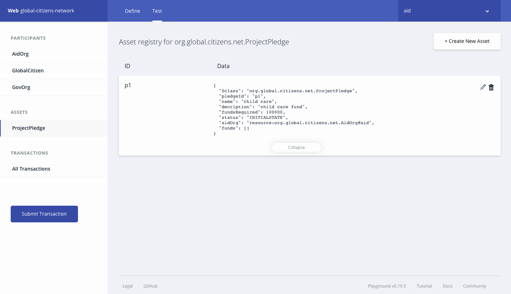

*Read this in other languages: [English](README.md), [日本語](README-ja.md).*

# Global-citizen

이 코드 패턴의 목표는 다음의 3개의 단체로 - 정부 기관을 대표하는 조직, 구호 제공을 목적으로 하는 NGO를 대표하는 조직, 그리고 Global Citizen을 대표하는 조직 - 구성된 블록체인 애플리케이션을 IBM Blockchain 플랫폼을 사용하여 빌드하는 것입니다. 

튜토리얼 레벨 : 중급 개발자

## 준비 사항

1. 무료 [IBM Cloud 계정](https://www.ibm.com/cloud/)

2. [NPM](https://www.npmjs.com/) 및 Node 설치 (노드 버전 8.10.0)

3. 다른 버전의 composer-cli를 사용하거나, .bna 파일을 배포해 본 적이 있는 경우에는 다음 명령어를 실행합니다
```
npm uninstall -g composer-cli
npm uninstall -g composer-rest-server
rm -rf ~/.composer
rm *.card
rm -rf credentials/
```

4. composer-cli 설치
```bash
npm install -g composer-cli@0.19.5
```

## 단계
1. [비즈니스 네트워크 아카이브 (BNA) 생성하기](#1-비즈니스-네트워크-아카이브-bna-생성하기)

2. [블록체인 서비스 생성하기](#2-블록체인-서비스-생성하기)

3. [암호 얻기](#3-암호-얻기)

4. [암호를 사용하여 인증 기관에서 인증서 가져오기](#4-암호를-사용하여-인증-기관에서-인증서-가져오기)

5. [admin-pub.pem 파일을 사용하여 피어에 인증서 추가하기](#5-admin-pubpem-파일을-사용하여-피어에-인증서-추가하기)

6. [어드민 비즈니스 네트워크 카드 만들기](#6-어드민-비즈니스-네트워크-카드-만들기)

7. [런타임 설치하고 네트워크 시작하기](#7-런타임-설치하고-네트워크-시작하기)

8. [새로운 비즈니스 네트워크 카드 생성하기](#8-비즈니스-네트워크-카드-생성하기)

9. [비즈니스 네트워크와 상호작용 하기](#9-비즈니스-네트워크와-상호작용-하기)

## 1. 비즈니스 네트워크 아카이브 (BNA) 생성하기

비즈니스 네트워크는 자산, 참가자, 트랜잭션, 엑세스 제어 규칙과 선택적으로 이벤트 및 쿼리로 구성됩니다. 이 스켈레톤 비즈니스 네트워크에는 비즈니스 네트워크의 모든 자산, 참가자, 및 트랜잭션에 대한 클래스 정의를 담고 있는 모델 (**.cto**) 파일이 있습니다. 스켈레톤 비즈니스 네트워크에는 또한 기본 엑세스 제어 규칙이 있는 엑세스 제어 (**permissions.acl**) 문서, 트랜잭션 프로세서 기능이 포함된 (**logic.js**) 스크립트 파일 그리고 비즈니스 네트워크 메타데이터를 담고 있는 **package.json** 파일도 포함되어 있습니다.

우선 BNA 파일을 만드는데 필요한 세 가지 구성요소인 로직 파일(**.js**), 모델 파일(**.cto**), 그리고 엑세스 제어 파일(**.acl**)이 포함된 저장소를 복제해야 합니다.
```bash
git clone https://github.com/IBM/global-citizen.git
```

파일의 구조가 유효한지 확인하기 위해 이제는 비즈니스 네트워크 정의에 대한 BNA (Business Network Archive) 파일을 생성합니다. 이 BNA 파일은 배포 가능한 유닛으로 실행을 위해 Composer 런타임에 배포할 수 있는 파일입니다. 
다음 명령어를 사용하여 네트워크 아카이브를 생성하십시오:
```bash
cd global-citizen
npm install
```

그러면 다음의 결과를 확인하실 수 있습니다:
```bash
Creating Business Network Archive


Looking for package.json of Business Network Definition
	Input directory: /Users/ishan/Documents/proj/global-citizens/global-citizens-network/global-citizen

Found:
	Description: This pattern should be able to Construct a 3-member blockchain application using the IBM Blockchain Platform, consisting of the following entities: an organization representing a government entity, an organization representing an NGO focused on the provision of aid, and an organization representing Global Citizen.
	Name: global-citizens-network
	Identifier: global-citizens-network@0.0.1

Written Business Network Definition Archive file to
Output file: global-citizens-network@0.0.1.bna

Command succeeded
```

이제 `global-citizens/dist` 디렉토리 안에 BNA 파일 (global-citizens-network.bna)이 있어야 합니다.

## 2. 블록체인 서비스 생성하기

1. 브라우저에서 이제 막 만들어 반짝반짝한 새 [IBM Cloud 계정](https://console.bluemix.net/dashboard/apps)으로 이동하십시오

2. 블록체인 서비스를 생성합니다:


## 3. 암호 얻기

1. 블록체인 서비스를 실행하고, 연결 프로파일을 클릭하여 JSON으로 봅니다

2. `registrar`가 보일 때까지 스크롤 다운한 다음 `enrollId` 아래에 `enrollSecret`이 있습니다. 이 암호를 복사하세요. 다음 단계에서 인증 기관(CA)용 비즈니스 네트워크 카드를 생성할 때 사용해야 합니다.


## 4. 암호를 사용하여 인증 기관에서 인증서 가져오기

1. 연결 프로파일을 다운로드합니다

2. 다운로드한 JSON 파일의 이름을 `connection-profile.json`로 변경합니다

3. `connection-profile.json` 파일을 `global-citizen` 디렉토리로 이동합니다

4. 이전 단계에서 확인한 `enrollSecret` 암호로 다음의 명령어가 인증기관(CA)용 비즈니스 네트워크 카드를 생성합니다
```bash
composer card create -f ca.card -p connection-profile.json -u admin -s <enrollSecret>
```

5. 다음의 명령어로 로컬 시스템 월렛에서 카드를 가져옵니다
```bash
composer card import -f ca.card -c ca
```

6. 마지막으로 `enrollSecret`이 포함된 가져온 카드를 사용하여 인증기관으로부터 인증서를 요청합니다. 인증서는 다음의 명령어를 완료한 후 생성되는 신임정보 디렉토리에 저장됩니다.
```bash
composer identity request --card ca --path ./credentials
```

## 5. admin-pub.pem 파일을 사용하여 피어에 인증서 추가하기

1. 다시 블록체인 서비스로 돌아와서 Members 탭을 클릭하여 인증서를 추가합니다. `global-citizen/credentials` 디렉토리로 가서 `admin-pub.pem`의 내용을 복사하여 인증서 박스에 붙여 넣습니다. 인증서를 제출하고 피어를 다시 시작합니다.

>주의: 피어를 다시 시작하는 데에는 1분 정도 소요됩니다.

2. 다음으로 채널의 인정서를 동기화해야 합니다. 블록체인 서비스에서 `my network` 밑에 있는 `Channels`를 클릭한 다음 3개의 점이 있는 버튼을 클릭합니다. 그런 다음 `Sync Certificate`을 클릭합니다.


## 6. 어드민 비즈니스 네트워크 카드 만들기

1. 이제 피어와 인증서를 동기화했으므로 어드민 카드를 생성하여 Hyperledger Composer 런타임을 설치하고 네트워크를 시작할 수 있습니다. 다음의 명령어를 사용하여 채널 관리자 및 피어 관리 역할을 가진 어드민 카드를 생성합니다:
```bash
composer card create -f adminCard.card -p connection-profile.json -u admin -c ./credentials/admin-pub.pem -k ./credentials/admin-priv.pem --role PeerAdmin --role ChannelAdmin
```

2. 이전 명령에서 생성된 카드 가져오기:
```bash
composer card import -f adminCard.card -c adminCard
```

## 7. 런타임 설치하고 네트워크 시작하기


1. 이제 다음의 명령어로 어드민 카드를 사용하여 네트워크를 설치합니다:
```bash
composer network install --card adminCard --archiveFile global-citizens-network@0.0.1.bna
```
>주의: 이 시점에서 오류가 발생하면 잠시 기다렸다가 다시 시도해 보십시오.

2. 어드민 카드, .bna 파일 경로 및 인증기관으로부터 받은 신임정보를 제공하여 비즈니스 네트워크를 시작하십시오. 이 명령어는 ‘delete_me.card’라 불리는 카드를 발행합니다.
```bash
composer network start --networkName global-citizens-network --networkVersion 0.0.1 -c adminCard -A admin -C ./credentials/admin-pub.pem -f delete_me.card
```
>주의: 이 시점에서 오류가 발생하면 잠시 기다렸다가 다시 시도해 보십시오.

3. 다음으로는 delete_me.card 를 삭제해 봅시다:
```bash
rm delete_me.card
```

## 8. 비즈니스 네트워크 카드 생성하기

1. 런타임을 설치하고 네트워크를 시작한 후에는 무료 계정(Starter Plan)에 배포할 카드를 만들어야 합니다. 다음 명령어를 사용하여 `adminCard.card`를 생성합니다:
```bash
composer card create -n global-citizens-network -p connection-profile.json -u admin -c ./credentials/admin-pub.pem -k ./credentials/admin-priv.pem
```

2. 비즈니스 네트워크 카드를 가져옵니다:
```bash
composer card import -f admin@global-citizens-network.card
```

3. 비즈니스 네트워크 카드를 테스트합니다:
```bash
composer network ping -c admin@global-citizens-network
```

## 9. 비즈니스 네트워크와 상호작용 하기

composer-playground 또는 composer-rest-server를 사용하여 비즈니스 네트워크와 상호 작용할 수 있습니다.

여기 링크를 클릭하여 [composer-playground](https://hyperledger.github.io/composer/latest/introduction/introduction)와 [composer-rest-server](https://hyperledger.github.io/composer/latest/integrating/getting-started-rest-api)에 대해 자세한 정보를 얻으십시오.

### a. Composer-Playground를 사용하여 상호작용 하기

1. Composer-Playground를 설치합니다:
```bash
npm install -g composer-playground@0.19.5
```
2. 이제 서버를 시작합니다. `connection-profile.json`과 같은 디렉토리에 있는지 확인하십시오. 
```bash
composer-playground
```
3. 브라우저에서 [http://localhost:8080/test](http://localhost:8080/test) 로 이동하여 비즈니스 네트워크에서 작업을 수행하십시오.

global-citizen 비즈니스 네트워크용 `Admin card`는Composer Playground에 생성됩니다.


`admin@global-citizens-network` 카드에 있는 `Connect now` 버튼을 클릭하여 global-citizen 비즈니스 네트워크에 연결합니다.


비즈니스 네트워크 정의를 테스트하려면 먼저 **Test** 탭을 클릭합니다:

`AidOrg` 참가자 레지스트리에서 새 참가자를 만듭니다. 왼쪽에 위치한 `AidOrg` 탭을 클릭하고 `Create New Participant` 버튼을 클릭하십시오.


`AidOrg` 참가자의 세부 정보를 입력하고 `Create New`를 클릭합니다


참가자 레지스트리에 새로운 `AidOrg` 참가자가 생성되었습니다. 네트워크의 다른 참가자도 마찬가지로 생성합니다.


연결 프로파일에는 패브릭에 연결하는데 필요한 정보가 들어있습니다. 비즈니스 네트워크 카드는 연결 프로필, ID 및 인증서를 결합하여 Hyperledger Composer Playground에 있는 비즈니스 네트워크에 연결할 수 있도록 합니다.

이제 네트워크 상의 참가자들에게 **Network Cards**를 추가할 준비가 완료되었습니다. 먼저 `admin`탭을 클릭한 후 `ID Registry`를 선택하여 **new ids**를 발행하고 ID를 월렛에 추가합니다.
아래 이미지에 있는 가이드를 따라 진행하세요:


`Use Now`를 클릭하여 네트워크에서 트랜잭션을 수행할 `AidOrg` 참여자 레지스트리를 선택합니다.


`CreateProjectPledge` 트랜잭션을 제출합니다.
```
{
  "$class": "org.global.citizens.net.CreateProjectPledge",
  "pledgeId": "p1",
  "name": "child care",
  "decription": "child care fund",
  "fundsRequired": 100000,
  "aidOrg": "resource:org.global.citizens.net.AidOrg#aid"
}
```


Asset 레지스트리에 새로운 프로젝트 서약서가 생성되었습니다.


Global Citizen에 프로젝트 자금을 받기 위한 서약서를 전송하기 위한 `SendPledgeToGlobalCitizen` 트랜젝션을 제출합니다.
```
{
  "$class": "org.global.citizens.net.SendPledgeToGlobalCitizen",
  "citizenId": "resource:org.global.citizens.net.GlobalCitizen#gc",
  "pledgeId": "resource:org.global.citizens.net.ProjectPledge#p1"
}
```


Global Citizen 참가자 레지스트리는 새로운 서약서로 업데이트됩니다.


Global Citizen에서 서약서를 검토합니다. 검증에 성공하면 프로젝트 서약서에 따른 정부 기관의 자금을 받기 위한 `SendPledgeToGovOrg` 트랜잭션이 제출됩니다.
```
{
  "$class": "org.global.citizens.net.SendPledgeToGovOrg",
  "govOrg": ["resource:org.global.citizens.net.GovOrg#gov"],
  "pledgeId": "resource:org.global.citizens.net.ProjectPledge#p1"
}
```


정부 기관에서 서약서를 검토합니다. 기관에서 프로젝트에 자금을 제공하기로 결정했는지 검토한 후, `UpdatePledge` 트랜잭션을 제출하여 프로젝트 서약서 자산을 업데이트합니다.
```
{
  "$class": "org.global.citizens.net.UpdatePledge",
  "govOrgId": "resource:org.global.citizens.net.GovOrg#gov",
  "pledgeId": "resource:org.global.citizens.net.ProjectPledge#p1",
  "fundingType": "WEEKLY",
  "approvedFunding": 100000,
  "fundsPerInstallment": 1000
}
```


정부 기관은 정기적으로 `TransferFunds` 트랜잭션을 제출하여 프로젝트에 자금을 송금합니다.
```
{
  "$class": "org.global.citizens.net.TransferFunds",
  "govOrgId": "resource:org.global.citizens.net.GovOrg#gov",
  "pledgeId": "resource:org.global.citizens.net.ProjectPledge#p1"
}
```


### b. composer-rest-server를 사용하여 상호작용 하기

1. composer-rest-server를 설치합니다:
```bash
npm install -g composer-rest-server@0.19.5
```

2. 이제 서버를 시작합니다. `connection-profile.json`와 같은 디렉토리에 있는지 확인합니다.
```bash
composer-rest-server -c admin@global-citizens-network -n never -w true
```

3. 브라우저에서 [http://localhost:3000/explorer](http://localhost:3000/explorer)로 이동합니다.

4. [Composer-Playground를 사용하여 상호작용 하기](#a-interact-using-composer-playground)에서 다뤘듯이 Swagger API를 사용하여 비즈니스 네트워크에서 운영할 수 있습니다.

## 코드 패턴 확장하기

1. 네트워크 권한을 추가합니다
2. 대시보드를 구현합니다
3. 결제 default를 추적하기 위한 로직을 구현합니다
4. Notification 로직을 구현합니다
5. 자금 이체 로직을 개선합니다

## 추가 리소스
* [Hyperledger Fabric Docs](http://hyperledger-fabric.readthedocs.io/en/latest/)
* [Hyperledger Composer Docs](https://hyperledger.github.io/composer/latest/introduction/introduction.html)

## 라이센스
[Apache 2.0](LICENSE)
