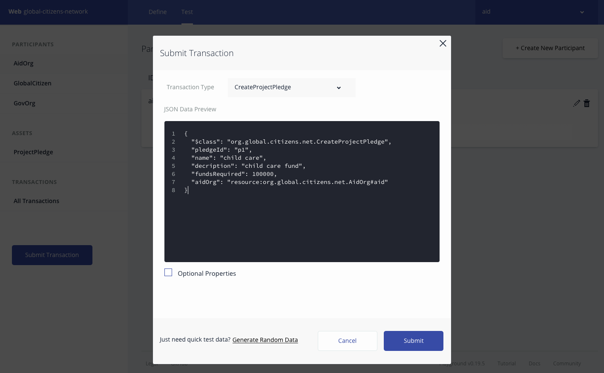
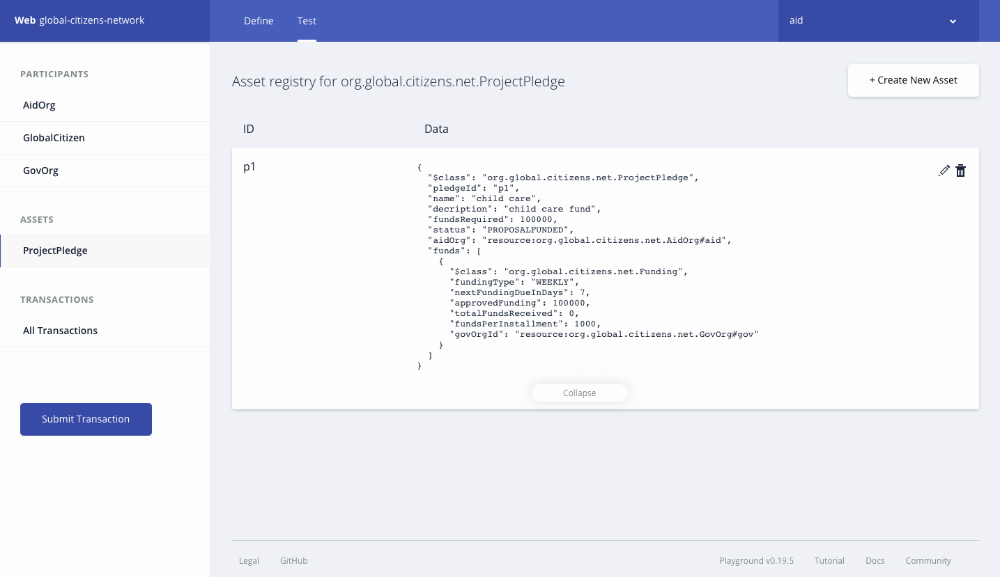

*Read this in other languages: [한국어](README-ko.md), [日本語](README-ja.md).*

# Global-citizen

The goal here is to build a 3-member blockchain application using the IBM Blockchain Platform, consisting of the following entities: an organization representing a government entity, an organization representing an NGO focused on the provision of aid, and an organization representing Global Citizen.

Audience level : Intermediate Developers

## Prerequisites

1. Free [IBM Cloud account](https://www.ibm.com/cloud/)

2. [NPM](https://www.npmjs.com/) and Node installed (node version 8.10.0)

3. If you have used other versions of composer-cli, or have deployed a .bna file before, run these commands
```
npm uninstall -g composer-cli
npm uninstall -g composer-rest-server
rm -rf ~/.composer
rm *.card
rm -rf credentials/
```

4. Install composer-cli
```bash
npm install -g composer-cli@0.20
```

## Steps
1. [Generate the Business Network Archive (BNA)](#1-generate-the-business-network-archive-bna)

2. [Create Blockchain Service](#2-create-blockchain-service)

3. [Get the secret](#3-get-the-secret)

4. [Use secret to get certificates from the certificate authority](#4-use-secret-to-get-certificates-from-the-certificate-authority)

5. [Use admin-pub.pem file to add certificates to the peers](#5-use-admin-pubpem-file-to-add-certificates-to-the-peers)

6. [Create admin business network card](#6-create-admin-business-network-card)

7. [Install runtime and start the network](#7-install-runtime-and-start-the-network)

8. [Create a new business network card](#8-create-a-new-business-network-card)

9. [Interact with the business network](#9-interact-with-the-business-network)

## 1. Generate the Business Network Archive (BNA)

A business network is made up of assets, participants, transactions, access control rules, and optionally events and queries. In this skeleton business network, there is a model (**.cto**) file which will contain the class definitions for all assets, participants, and transactions in the business network. The skeleton business network also contains an access control (**permissions.acl**) document with basic access control rules, a script (**logic.js**) file containing transaction processor functions, and a **package.json** file containing business network metadata.

First we need to clone a repo that contains the three components that are needed to make a BNA file: a logic file(**.js**) , a model file(**.cto**), and an access control(**.acl**) file.
```bash
git clone https://github.com/IBM/global-citizen.git
```

To check that the structure of the files is valid, you can now generate a Business Network Archive (BNA) file for your business network definition. The BNA file is the deployable unit -- a file that can be deployed to the Composer runtime for execution.
Use the following command to generate the network archive:
```bash
cd global-citizen
npm install
```

You should see the following output:
```bash
Creating Business Network Archive


Looking for package.json of Business Network Definition
	Input directory: /Users/ishan/Documents/proj/global-citizens/global-citizens-network/global-citizen

Found:
	Description: This pattern should be able to Construct a 3-member blockchain application using the IBM Blockchain Platform, consisting of the following entities: an organization representing a government entity, an organization representing an NGO focused on the provision of aid, and an organization representing Global Citizen.
	Name: global-citizens-network
	Identifier: global-citizens-network@0.0.1

Written Business Network Definition Archive file to
Output file: global-citizens-network@0.0.1.bna

Command succeeded
```

Now you should have a BNA file, (global-citizens-network.bna), that is in your `global-citizens/dist` directory.

## 2. Create Blockchain Service

1. In your browser go to your shiny new [IBM Cloud account](https://console.bluemix.net/dashboard/apps)

2. Create a blockchain service:


## 3. Get the secret

1. Launch your blockchain service, and click on connection profile, and view as raw JSON

2. Scroll all the way down until you see `registrar` and then under `enrollId` will be `enrollSecret`. Copy this secret, we will need it for the next step for creating the a business network card for the certificate authority (CA)


## 4. Use secret to get certificates from the certificate authority

1. Download the connection profile

2. Rename the downloaded JSON file to `connection-profile.json`

3. Move the `connection-profile.json` file to the `global-citizen` directory

4. Using the `enrollSecret` from the previous step issue this command to create a business network card for the certificate authority (CA)
```bash
composer card create -f ca.card -p connection-profile.json -u admin -s <enrollSecret>
```

5. Import the card in your local system wallet with this command
```bash
composer card import -f ca.card -c ca
```

6. Finally, we request certificates from the CA using the card we imported that contains our `enrollSecret`. The certificates are stored in the credentials directory that is created after the completion of this command.
```bash
composer identity request --card ca --path ./credentials
```

## 5. Use admin-pub.pem file to add certificates to the peers

1. Back in the blockchain service, click on the members tab, then add certificate. Go to your `global-citizen/credentials` directory, and copy and paste the contents of the `admin-pub.pem` file in the certificate box. Submit the certificate and restart the peers.

>Note: restarting the peers takes a minute.

2. Next, we need to synchronize the certificates of the channel. From our blockchain service, under `my network` click on `Channels` and then the three-dot button. Then click `Sync Certificate`.


## 6. Create admin business network card

1. Now that we have synced certificates with our peers, we can install the Hyperledger Composer runtime and start the network by creating an admin card. Create the admin card with the channel admin and peer admin roles with the following command:
```bash
composer card create -f adminCard.card -p connection-profile.json -u admin -c ./credentials/admin-pub.pem -k ./credentials/admin-priv.pem --role PeerAdmin --role ChannelAdmin
```

2. Import the card created from the previous command:
```bash
composer card import -f adminCard.card -c adminCard
```

## 7. Install runtime and start the network


1. Now we will use the admin card to install the network with the following command:
```bash
composer network install --card adminCard --archiveFile global-citizens-network@0.0.1.bna
```
>Note: If you get an error at this point, wait a minute and try again.

2. Start the business network by providing the admin card, the path to the .bna file, and the credentials received from the CA. This command will issue a card which we will remove, called ‘delete_me.card’.
```bash
composer network start --networkName global-citizens-network --networkVersion 0.0.1 -c adminCard -A admin -C ./credentials/admin-pub.pem -f delete_me.card
```
>Note: If you get an error at this point, wait a minute and try again.

3. Next, let’s delete delete_me.card :
```bash
rm delete_me.card
```

## 8. Create a new business network card

1. After we have installed the runtime and started the network, we need to create a card which we will deploy to the Starter Plan. Use the following command to create `adminCard.card`:
```bash
composer card create -n global-citizens-network -p connection-profile.json -u admin -c ./credentials/admin-pub.pem -k ./credentials/admin-priv.pem
```

2. Import the business network card:
```bash
composer card import -f admin@global-citizens-network.card
```

3. Test the business network card:
```bash
composer network ping -c admin@global-citizens-network
```

## 9. Interact with the business network

You can either use composer-playground or composer-rest-server to interact with the business network.

Use the links to get more information about [composer-playground](https://hyperledger.github.io/composer/latest/introduction/introduction) and [composer-rest-server](https://hyperledger.github.io/composer/latest/integrating/getting-started-rest-api).

### a. Interact using Composer-Playground

1. Install Composer-Playground:
```bash
npm install -g composer-playground@0.20
```
2. Now, let’s start up the server. Make sure you are in the same directory as your `connection-profile.json`
```bash
composer-playground
```
3. In your browser, go to [http://localhost:8080/test](http://localhost:8080/test) to perform operations in business network.

`Admin card` for global-citizen business network is created in Composer Playground.


Click on `Connect now` button present on `admin@global-citizens-network` card to connect to global-citizen business network


To test your Business Network Definition, first click on the **Test** tab:

In the `AidOrg` participant registry, create a new participant. Make sure you click on the `AidOrg` tab on the far left-hand side first and click on `Create New Participant` button


Fill the details for `AidOrg` participant and click on `Create New`


New `AidOrg` participant created in participant registry. Similarly create the other participants for the network.


Connection profiles contain the information necessary to connect to a fabric. Business network cards combine a connection profile, identity, and certificates to allow a connection to a business network in Hyperledger Composer Playground.

Now we are ready to add **Network Cards** for the participants in network. Do this by first clicking on the `admin` tab and select `ID Registry` to issue **new ids** to the participants and add the ids to the wallet.
Please follow the instructions as shown in the images below:


Click on `Use Now` to select the `AidOrg` participant registry to perform transactions on network.


Submit `CreateProjectPledge` transaction.
```
{
  "$class": "org.global.citizens.net.CreateProjectPledge",
  "pledgeId": "p1",
  "name": "child care",
  "decription": "child care fund",
  "fundsRequired": 100000,
  "aidOrg": "resource:org.global.citizens.net.AidOrg#aid"
}
```


New project pledge is created in Asset Registry.


Submit `SendPledgeToGlobalCitizen` transaction to send the pledge to global citizen to get the funds for the project.
```
{
  "$class": "org.global.citizens.net.SendPledgeToGlobalCitizen",
  "citizenId": "resource:org.global.citizens.net.GlobalCitizen#gc",
  "pledgeId": "resource:org.global.citizens.net.ProjectPledge#p1"
}
```


Global Citizen participant registry gets update with the new pledge request.


Global Citizen reviews the pledge. After successful verification it submits a`SendPledgeToGovOrg` transaction to get funds for the project pledge from government organizations.
```
{
  "$class": "org.global.citizens.net.SendPledgeToGovOrg",
  "govOrg": ["resource:org.global.citizens.net.GovOrg#gov"],
  "pledgeId": "resource:org.global.citizens.net.ProjectPledge#p1"
}
```


Government organizations reviews the pledge. After reviewing if they decide to fund the project then they submit a `UpdatePledge` transaction to update the project pledge asset.
```
{
  "$class": "org.global.citizens.net.UpdatePledge",
  "govOrgId": "resource:org.global.citizens.net.GovOrg#gov",
  "pledgeId": "resource:org.global.citizens.net.ProjectPledge#p1",
  "fundingType": "WEEKLY",
  "approvedFunding": 100000,
  "fundsPerInstallment": 1000
}
```




Government organizations periodically sends the funds to project by submitting `TransferFunds` transaction.
```
{
  "$class": "org.global.citizens.net.TransferFunds",
  "govOrgId": "resource:org.global.citizens.net.GovOrg#gov",
  "pledgeId": "resource:org.global.citizens.net.ProjectPledge#p1"
}
```


### b. Interact using composer-rest-server

1. Install the composer-rest-server:
```bash
npm install -g composer-rest-server@0.20
```

2. Now, let’s start up the server. Make sure you are in the same directory as your `connection-profile.json`
```bash
composer-rest-server -c admin@global-citizens-network -n never -w true
```

3. In your browser, go to [http://localhost:3000/explorer](http://localhost:3000/explorer)

4. Now you can use the swagger api to perform operations in business network as shown in [Interact using Composer-Playground](#a-interact-using-composer-playground)

## Extending Pattern

1. Add Network Permissions
2. Implement Dashboards
3. Implement logic for tracking payments default
4. Implement Notification logic
5. Improve transfer fund logic

## Additional Resources
* [Hyperledger Fabric Docs](http://hyperledger-fabric.readthedocs.io/en/latest/)
* [Hyperledger Composer Docs](https://hyperledger.github.io/composer/latest/introduction/introduction.html)

## License
This code pattern is licensed under the Apache Software License, Version 2.  Separate third party code objects invoked within this code pattern are licensed by their respective providers pursuant to their own separate licenses. Contributions are subject to the [Developer Certificate of Origin, Version 1.1 (DCO)](https://developercertificate.org/) and the [Apache Software License, Version 2](http://www.apache.org/licenses/LICENSE-2.0.txt).

[Apache Software License (ASL) FAQ](http://www.apache.org/foundation/license-faq.html#WhatDoesItMEAN)
