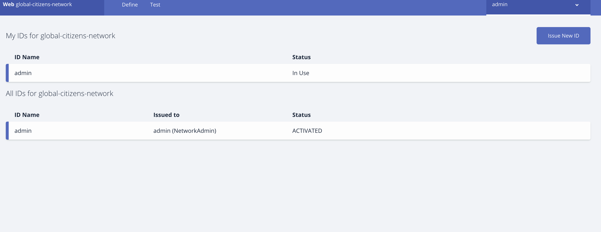

# Global-citizen

## Steps
1. [Generate the Business Network Archive (BNA)](#1-generate-the-business-network-archive-bna)
2. [Deploy the Business Network Archive using Composer Playground](#2-deploy-the-business-network-archive-using-composer-playground)


## 1. Generate the Business Network Archive (BNA)

To check that the structure of the files is valid, you can now generate a Business Network Archive (BNA) file for your business network definition. The BNA file is the deployable unit -- a file that can be deployed to the Composer runtime for execution.

Use the following command to generate the network archive:
```bash
npm install
```
You should see the following output:
```bash
Creating Business Network Archive


Looking for package.json of Business Network Definition
	Input directory: /Users/ishan/Documents/proj/global-citizens/global-citizens-network/global-citizen

Found:
	Description: This pattern should be able to Construct a 3-member blockchain application using the IBM Blockchain Platform, consisting of the following entities: an organization representing a government entity, an organization representing an NGO focused on the provision of aid, and an organization representing Global Citizen.
	Name: global-citizens-network
	Identifier: global-citizens-network@0.0.1

Written Business Network Definition Archive file to
Output file: ./dist/global-citizens-network.bna

Command succeeded
```

## 2. Deploy the Business Network Archive using Composer Playground
Open [Composer Playground](http://composer-playground.mybluemix.net/), by default the Basic Sample Network is imported.
If you have previously used Playground, be sure to clear your browser local storage by running `localStorage.clear()` in your browser Console.

Now import the `fglobal-citizens-network.bna` file and click on deploy button.


>You can also setup [Composer Playground locally](https://hyperledger.github.io/composer/installing/using-playground-locally.html).

To test your Business Network Definition, first click on the **Test** tab:





## Additional Resources
* [Hyperledger Fabric Docs](http://hyperledger-fabric.readthedocs.io/en/latest/)
* [Hyperledger Composer Docs](https://hyperledger.github.io/composer/introduction/introduction.html)


## License
[Apache 2.0](LICENSE)
