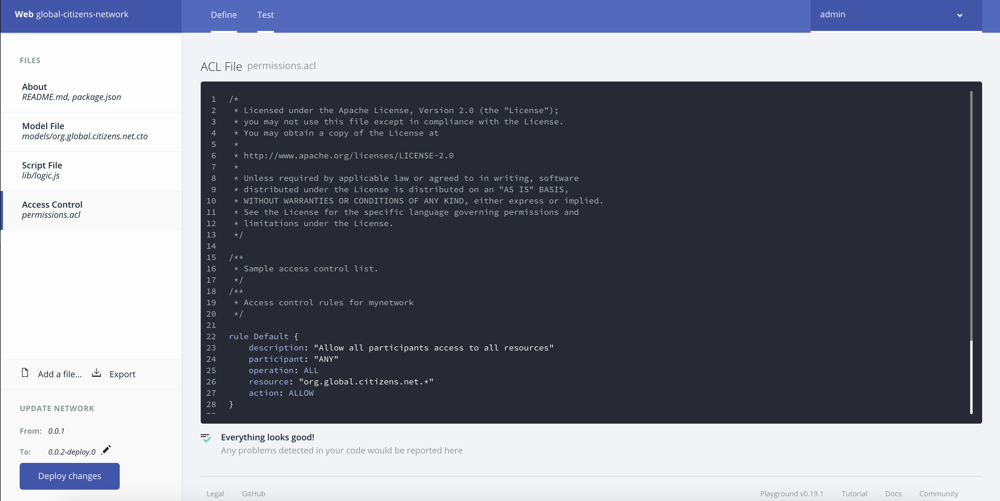
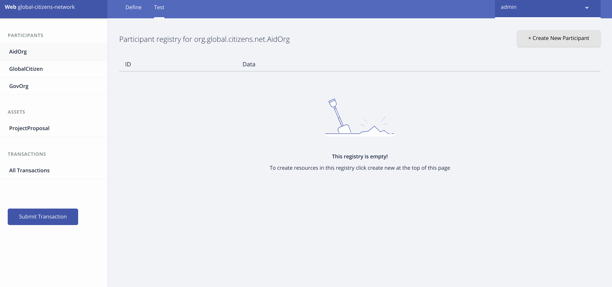
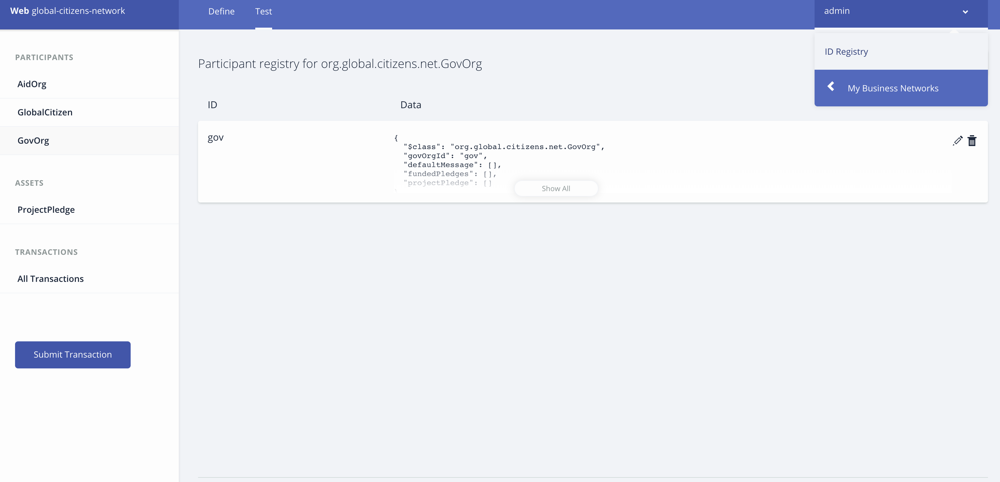
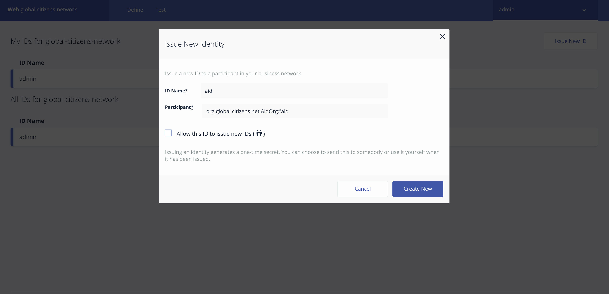
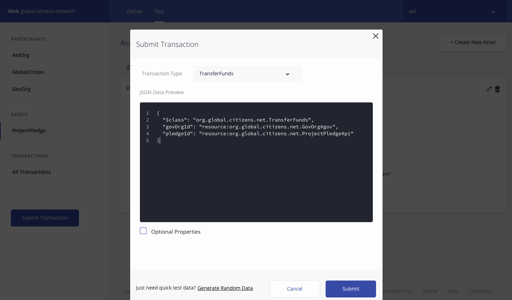

# Global-citizen

## Steps
1. [Generate the Business Network Archive (BNA)](#1-generate-the-business-network-archive-bna)
2. [Deploy the Business Network Archive using Composer Playground](#2-deploy-the-business-network-archive-using-composer-playground)


## 1. Generate the Business Network Archive (BNA)

To check that the structure of the files is valid, you can now generate a Business Network Archive (BNA) file for your business network definition. The BNA file is the deployable unit -- a file that can be deployed to the Composer runtime for execution.

Use the following command to generate the network archive:
```bash
npm install
```
You should see the following output:
```bash
Creating Business Network Archive


Looking for package.json of Business Network Definition
	Input directory: /Users/ishan/Documents/proj/global-citizens/global-citizens-network/global-citizen

Found:
	Description: This pattern should be able to Construct a 3-member blockchain application using the IBM Blockchain Platform, consisting of the following entities: an organization representing a government entity, an organization representing an NGO focused on the provision of aid, and an organization representing Global Citizen.
	Name: global-citizens-network
	Identifier: global-citizens-network@0.0.1

Written Business Network Definition Archive file to
Output file: ./dist/global-citizens-network.bna

Command succeeded
```

## 2. Deploy the Business Network Archive using Composer Playground
Open [Composer Playground](http://composer-playground.mybluemix.net/), by default the Basic Sample Network is imported.
If you have previously used Playground, be sure to clear your browser local storage by running `localStorage.clear()` in your browser Console.

Navigate to Composer Playground url in browser and click on `Deploy a new business network`


Click on `Drop here to upload or browser` to import the `global-citizens-network.bna` file


Click on `Deploy` to deploy the global-citizen business network.


`Admin card` for global-citizen business network is created in Composer Playground.


Click on `Connect now` to connect to global-citizen business network


>You can also setup [Composer Playground locally](https://hyperledger.github.io/composer/installing/using-playground-locally.html).

To test your Business Network Definition, first click on the **Test** tab:

In the `AidOrg` participant registry, create a new participant. Make sure you click on the `AidOrg` tab on the far left-hand side first and click on `Create New Participant` button


Fill the details for `AidOrg` participant and click on `Create New`


New `AidOrg` participant created in participant registry. Similarly create the other participants for the network.


Now we are ready to add **Network Cards** for the participants in network. Do this by first clicking on the `admin` tab and select `ID Registry` to issue **new ids** to the participants and add the ids to the wallet.
Please follow the instructions as shown in the images below:





Click on `Use Now` to select the `AidOrg` participant registry to perform transactions on network.


Submit `CreateProjectProposal` transaction.
```
{
  "$class": "org.global.citizens.net.CreateProjectProposal",
  "name": "child care",
  "decription": "child care fund",
  "fundsRequired": 100000,
  "aidOrg": "resource:org.global.citizens.net.AidOrg#aid"
}
```


New project proposal is created in Asset Registry.


Submit `SendProposalToGlobalCitizen` transaction to send the proposal to global citizen to get the funds for the project.
```
{
  "$class": "org.global.citizens.net.SendProposalToGlobalCitizen",
  "citizenId": "resource:org.global.citizens.net.GlobalCitizen#gc",
  "proposalId": "resource:org.global.citizens.net.ProjectProposal#<ProjectProposal ID>"
}
```


Global Citizen participant registry gets update with the new proposal request.


Global Citizen reviews the proposal. After successful verification it submits a`SendProposalToGovOrg` transaction to get funds for the project proposal from government organizations.
```
{
  "$class": "org.global.citizens.net.SendProposalToGovOrg",
  "govOrg": ["resource:org.global.citizens.net.GovOrg#gov"],
  "proposalId": "resource:org.global.citizens.net.ProjectProposal#<ProjectProposal ID>"
}
```


Government organizations reviews the proposal. After reviewing if they decide to fund the project then they submit a `UpdateProposal` transaction to update the project proposal asset.
```
{
  "$class": "org.global.citizens.net.UpdateProposal",
  "govOrgId": "resource:org.global.citizens.net.GovOrg#gov",
  "proposalId": "resource:org.global.citizens.net.ProjectProposal#<ProjectProposal ID>",
  "fundingType": "WEEKLY",
  "approvedFunding": 100000,
  "fundsPerInstallment": 1000
}
```




Government organizations periodically sends the funds to project by submitting `TransferFunds` transaction.
```
{
  "$class": "org.global.citizens.net.TransferFunds",
  "govOrgId": "resource:org.global.citizens.net.GovOrg#gov",
  "proposalId": "resource:org.global.citizens.net.ProjectProposal#<ProjectProposal ID>"
}
```


## Additional Resources
* [Hyperledger Fabric Docs](http://hyperledger-fabric.readthedocs.io/en/latest/)
* [Hyperledger Composer Docs](https://hyperledger.github.io/composer/introduction/introduction.html)


## License
[Apache 2.0](LICENSE)
